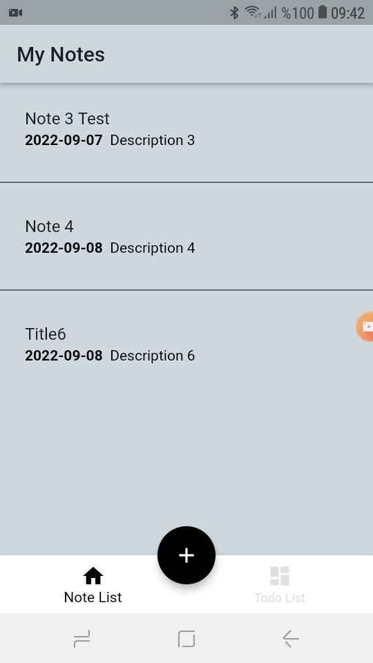
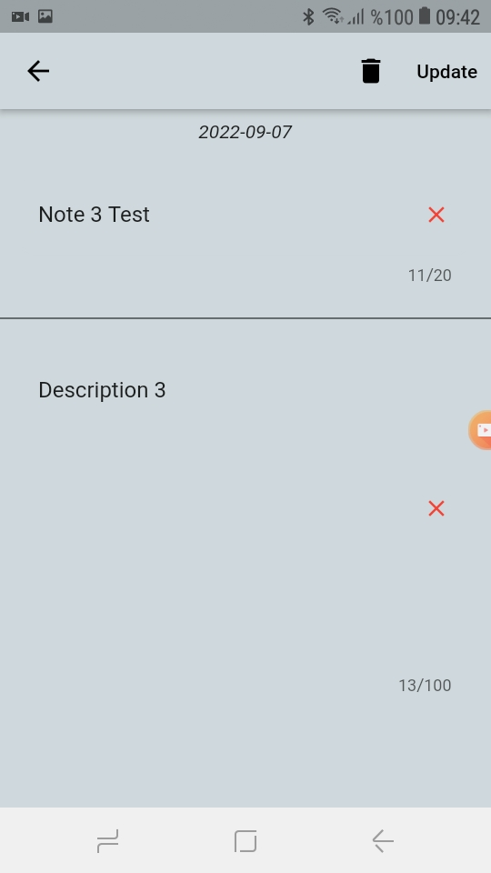
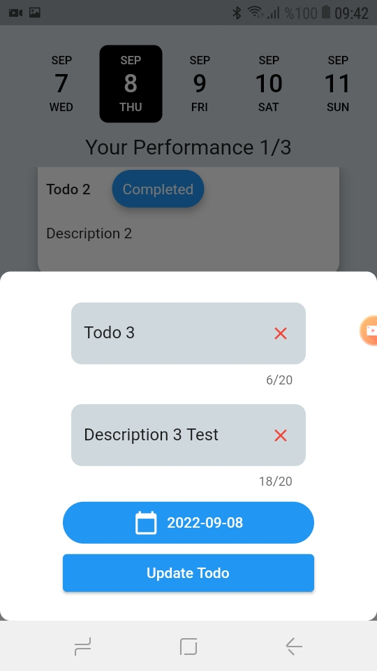
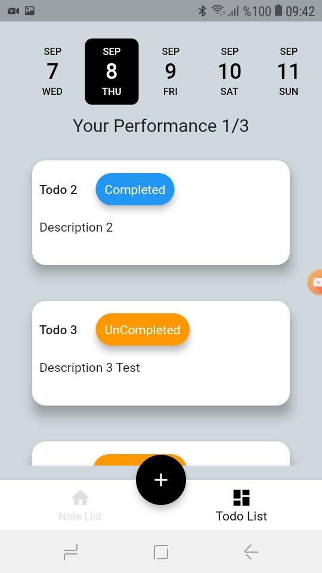
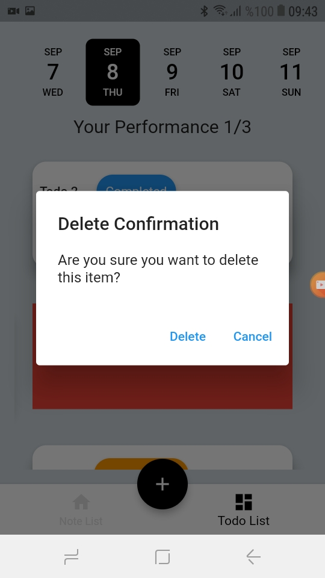

# Taking Notes and Todo 

Bu uygulama Flutter Frameworku ile yapılmıştır.Uygulamada MVVM yapısı kullanılmıştır.

# Özellikler

- [x] Merkezi Routing
- [x] Provider
- [x] erkezi Tema Yönetimi

Back-end tarafında ise .Net Core-C#-MSSQL-Entity Framework kullanılmıştır.

Demo Video

https://user-images.githubusercontent.com/58534335/189056207-7d3c2ccd-1947-45bb-ad54-e2d4df118801.mp4

## Ekran Görüntüleri

